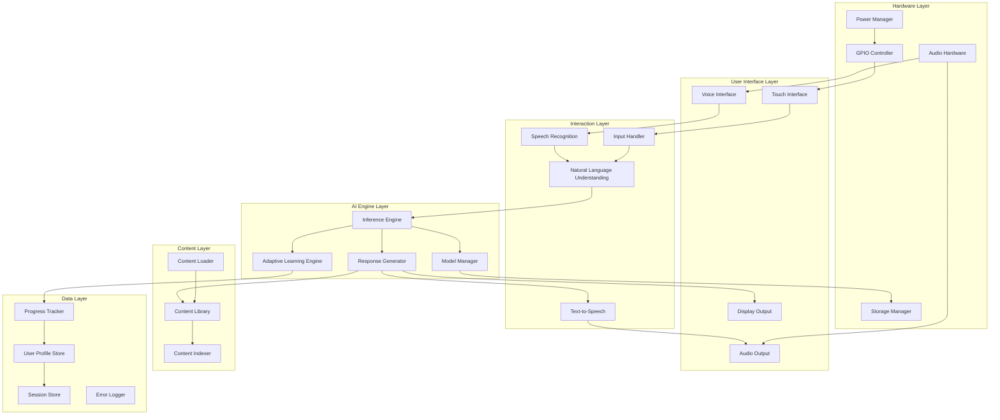

# Design Document: Offline AI-Powered Interactive Learning Robot

## Overview

The Offline AI-Powered Interactive Learning Robot is a self-contained educational system running on Raspberry Pi hardware. The system provides intelligent, adaptive learning experiences without requiring internet connectivity by utilizing locally stored AI models, educational content, and user data.

The architecture prioritizes resource efficiency to operate within Raspberry Pi constraints while maintaining responsive interactions and intelligent behavior. All AI inference, content delivery, and user interaction processing occurs locally using optimized models and algorithms.

## Architecture

### System Architecture



### Component Responsibilities

**User Interface Layer**: Handles all physical interactions with users through voice, touch, display, and audio output.

**Interaction Layer**: Processes raw user inputs into structured data and generates appropriate output formats.

**AI Engine Layer**: Provides intelligent behavior through model inference, adaptive learning algorithms, and contextual response generation.

**Content Layer**: Manages educational content storage, retrieval, and organization.

**Data Layer**: Persists user data, session information, progress tracking, and system logs.

**Hardware Layer**: Interfaces with Raspberry Pi hardware components and manages system resources.

## Components and Interfaces

### Speech Recognition (ASR)

**Purpose**: Convert spoken audio to text using offline models.

**Technology**: Vosk or Whisper.cpp (quantized models optimized for ARM)

**Interface**:
```python
class SpeechRecognizer:
    def initialize(model_path: str) -> bool
    def recognize_stream(audio_stream: AudioStream) -> RecognitionResult
    def recognize_file(audio_file: str) -> RecognitionResult
    def set_language(language_code: str) -> bool
```

**Model Storage**: 50-200MB per language model stored in `/models/asr/`

**Performance Target**: < 2 seconds latency for typical utterances (5-10 words)

### Natural Language Understanding (NLU)

**Purpose**: Extract intent and entities from recognized text.

**Technology**: Lightweight transformer model (DistilBERT or TinyBERT) fine-tuned for educational domain, or rule-based intent classifier for resource efficiency.

**Interface**:
```python
class NLUEngine:
    def initialize(model_path: str, intent_config: str) -> bool
    def parse(text: str) -> Intent
    def extract_entities(text: str) -> List[Entity]
    
class Intent:
    name: str
    confidence: float
    entities: Dict[str, Any]
```

**Intent Categories**:
- `ask_question`: User asking for information
- `request_activity`: User requesting a learning activity
- `provide_answer`: User answering a question
- `request_help`: User needs assistance
- `navigate`: User navigating content
- `feedback`: User providing feedback

### Text-to-Speech (TTS)

**Purpose**: Generate natural-sounding speech from text responses.

**Technology**: Piper TTS (optimized for Raspberry Pi) or eSpeak-ng for lightweight option

**Interface**:
```python
class TextToSpeech:
    def initialize(voice_model: str) -> bool
    def synthesize(text: str) -> AudioData
    def synthesize_to_file(text: str, output_path: str) -> bool
    def set_voice_parameters(rate: float, pitch: float, volume: float) -> None
```

**Model Storage**: 10-50MB per voice model

**Performance Target**: Real-time synthesis (1x speed or faster)

### Inference Engine

**Purpose**: Run AI model inference for question answering and content understanding.

**Technology**: ONNX Runtime or TensorFlow Lite for ARM optimization

**Interface**:
```python
class InferenceEngine:
    def load_model(model_path: str, model_type: ModelType) -> ModelHandle
    def infer(model_handle: ModelHandle, input_data: Any) -> InferenceResult
    def unload_model(model_handle: ModelHandle) -> bool
    
class ModelType(Enum):
    QA_MODEL = "question_answering"
    CLASSIFICATION = "classification"
    EMBEDDING = "embedding"
```

**Model Types**:
- Question Answering: Retrieves answers from content context
- Text Classification: Categorizes user inputs and content
- Embedding: Generates semantic representations for content matching

### Adaptive Learning Engine

**Purpose**: Adjust content difficulty and recommendations based on user performance.

**Algorithm**: Bayesian Knowledge Tracing or simpler rule-based difficulty adjustment

**Interface**:
```python
class AdaptiveLearningEngine:
    def initialize(user_profile: UserProfile) -> None
    def record_activity_result(activity_id: str, score: float, time_taken: float) -> None
    def get_recommended_difficulty() -> DifficultyLevel
    def get_next_activities(count: int) -> List[Activity]
    def update_knowledge_state(concept: str, mastery: float) -> None
    
class DifficultyLevel(Enum):
    BEGINNER = 1
    INTERMEDIATE = 2
    ADVANCED = 3
```

**Adaptation Strategy**:
- Track success rate over last 5 activities
- If success rate > 80%: increase difficulty
- If success rate < 50%: decrease difficulty
- If success rate 50-80%: maintain current level

### Response Generator

**Purpose**: Create contextual, educational responses to user inputs.

**Strategy**: Template-based generation with dynamic content insertion, optionally enhanced with small language model for variety.

**Interface**:
```python
class ResponseGenerator:
    def initialize(template_library: str, content_library: ContentLibrary) -> None
    def generate_response(intent: Intent, context: SessionContext) -> Response
    def generate_question(topic: str, difficulty: DifficultyLevel) -> Question
    def generate_explanation(concept: str, user_level: DifficultyLevel) -> str
    
class Response:
    text: str
    audio_cues: List[str]
    display_content: Optional[DisplayContent]
    follow_up_actions: List[Action]
```

**Template Categories**:
- Greetings and acknowledgments
- Question prompts
- Explanations and teaching
- Feedback (positive, corrective, encouraging)
- Navigation and help

### Content Library

**Purpose**: Store and retrieve educational content efficiently.

**Storage Format**: SQLite database with indexed content + file system for media

**Interface**:
```python
class ContentLibrary:
    def initialize(db_path: str, media_path: str) -> bool
    def search_content(query: str, filters: ContentFilters) -> List[ContentItem]
    def get_content_by_id(content_id: str) -> ContentItem
    def get_activities_by_topic(topic: str, difficulty: DifficultyLevel) -> List[Activity]
    def add_content_package(package_path: str) -> bool
    
class ContentItem:
    id: str
    title: str
    subject: str
    difficulty: DifficultyLevel
    content_type: ContentType
    data: Any
    metadata: Dict[str, Any]
    
class ContentType(Enum):
    TEXT = "text"
    AUDIO = "audio"
    IMAGE = "image"
    ACTIVITY = "activity"
    QUIZ = "quiz"
```

**Database Schema**:
```sql
CREATE TABLE content (
    id TEXT PRIMARY KEY,
    title TEXT NOT NULL,
    subject TEXT NOT NULL,
    difficulty INTEGER NOT NULL,
    content_type TEXT NOT NULL,
    data_path TEXT,
    metadata TEXT,
    created_at TIMESTAMP,
    INDEX idx_subject_difficulty (subject, difficulty)
);

CREATE TABLE topics (
    id TEXT PRIMARY KEY,
    name TEXT NOT NULL,
    parent_topic_id TEXT,
    FOREIGN KEY (parent_topic_id) REFERENCES topics(id)
);

CREATE TABLE content_topics (
    content_id TEXT,
    topic_id TEXT,
    PRIMARY KEY (content_id, topic_id),
    FOREIGN KEY (content_id) REFERENCES content(id),
    FOREIGN KEY (topic_id) REFERENCES topics(id)
);
```

### User Profile Store

**Purpose**: Persist user profiles, preferences, and learning history.

**Storage**: JSON files per user + SQLite for queryable data

**Interface**:
```python
class UserProfileStore:
    def create_user(username: str) -> UserProfile
    def load_user(username: str) -> UserProfile
    def save_user(profile: UserProfile) -> bool
    def list_users() -> List[str]
    def delete_user(username: str) -> bool
    
class UserProfile:
    username: str
    created_at: datetime
    preferences: UserPreferences
    knowledge_state: Dict[str, float]  # concept -> mastery level
    activity_history: List[ActivityRecord]
    current_difficulty: DifficultyLevel
    
class UserPreferences:
    voice_speed: float
    interaction_mode: str  # "voice", "touch", "both"
    preferred_subjects: List[str]
```

### Session Store

**Purpose**: Manage active learning sessions and persist session data.

**Interface**:
```python
class SessionStore:
    def start_session(username: str) -> Session
    def get_active_session() -> Optional[Session]
    def end_session(session_id: str) -> bool
    def save_session_state(session: Session) -> bool
    
class Session:
    session_id: str
    username: str
    start_time: datetime
    end_time: Optional[datetime]
    activities_completed: List[str]
    current_context: SessionContext
    
class SessionContext:
    current_topic: Optional[str]
    current_activity: Optional[Activity]
    conversation_history: List[Interaction]
    user_state: UserState  # engaged, struggling, mastered, etc.
```

### Input Handler

**Purpose**: Coordinate multi-modal inputs and route to appropriate processors.

**Interface**:
```python
class InputHandler:
    def initialize(asr: SpeechRecognizer, touch_controller: TouchController) -> None
    def start_listening() -> None
    def stop_listening() -> None
    def register_touch_callback(callback: Callable) -> None
    def get_next_input(timeout: float) -> UserInput
    
class UserInput:
    input_type: InputType
    data: Any
    timestamp: datetime
    
class InputType(Enum):
    VOICE = "voice"
    TOUCH = "touch"
    COMBINED = "combined"
```

### Power Manager

**Purpose**: Manage system power states and battery monitoring.

**Interface**:
```python
class PowerManager:
    def initialize() -> bool
    def get_power_status() -> PowerStatus
    def enter_standby() -> bool
    def wake_from_standby() -> bool
    def register_low_power_callback(callback: Callable) -> None
    def set_idle_timeout(seconds: int) -> None
    
class PowerStatus:
    is_battery_powered: bool
    battery_level: Optional[float]  # 0.0 to 1.0
    power_state: PowerState
    
class PowerState(Enum):
    ACTIVE = "active"
    STANDBY = "standby"
    LOW_POWER = "low_power"
```

## Data Models

### Activity

```python
class Activity:
    id: str
    title: str
    description: str
    activity_type: ActivityType
    topic: str
    difficulty: DifficultyLevel
    estimated_duration: int  # seconds
    content: ActivityContent
    evaluation_criteria: EvaluationCriteria
    
class ActivityType(Enum):
    QUIZ = "quiz"
    EXERCISE = "exercise"
    EXPLORATION = "exploration"
    PRACTICE = "practice"
    
class ActivityContent:
    instructions: str
    questions: List[Question]
    resources: List[ContentItem]
    
class Question:
    id: str
    text: str
    question_type: QuestionType
    correct_answer: Any
    possible_answers: Optional[List[str]]
    hints: List[str]
    
class QuestionType(Enum):
    MULTIPLE_CHOICE = "multiple_choice"
    TRUE_FALSE = "true_false"
    SHORT_ANSWER = "short_answer"
    SPOKEN_RESPONSE = "spoken_response"
```

### Activity Record

```python
class ActivityRecord:
    activity_id: str
    user: str
    start_time: datetime
    end_time: datetime
    score: float  # 0.0 to 1.0
    attempts: int
    time_taken: int  # seconds
    responses: List[UserResponse]
    mastery_demonstrated: float  # 0.0 to 1.0
    
class UserResponse:
    question_id: str
    user_answer: Any
    is_correct: bool
    time_to_answer: int  # seconds
    hints_used: int
```

### Error Log Entry

```python
class ErrorLogEntry:
    timestamp: datetime
    error_type: ErrorType
    component: str
    message: str
    stack_trace: Optional[str]
    user_context: Optional[str]
    
class ErrorType(Enum):
    HARDWARE_ERROR = "hardware"
    MODEL_ERROR = "model"
    CONTENT_ERROR = "content"
    SYSTEM_ERROR = "system"
```

## Correctness Properties

*A property is a characteristic or behavior that should hold true across all valid executions of a system—essentially, a formal statement about what the system should do. Properties serve as the bridge between human-readable specifications and machine-verifiable correctness guarantees.*

